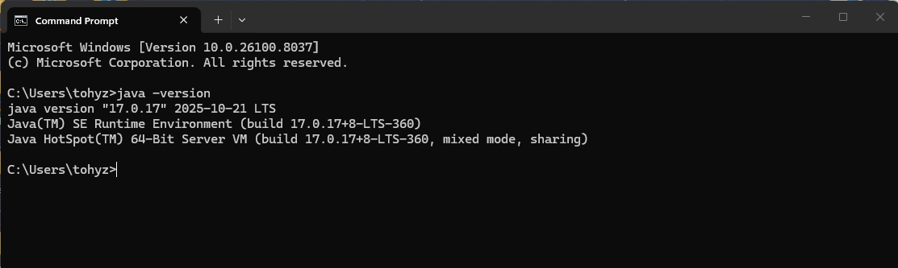
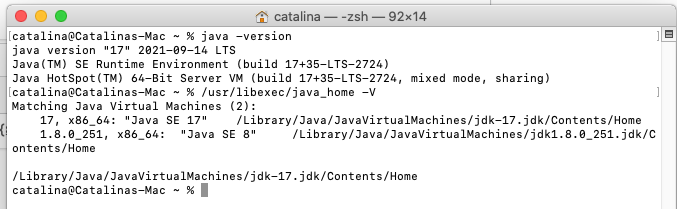
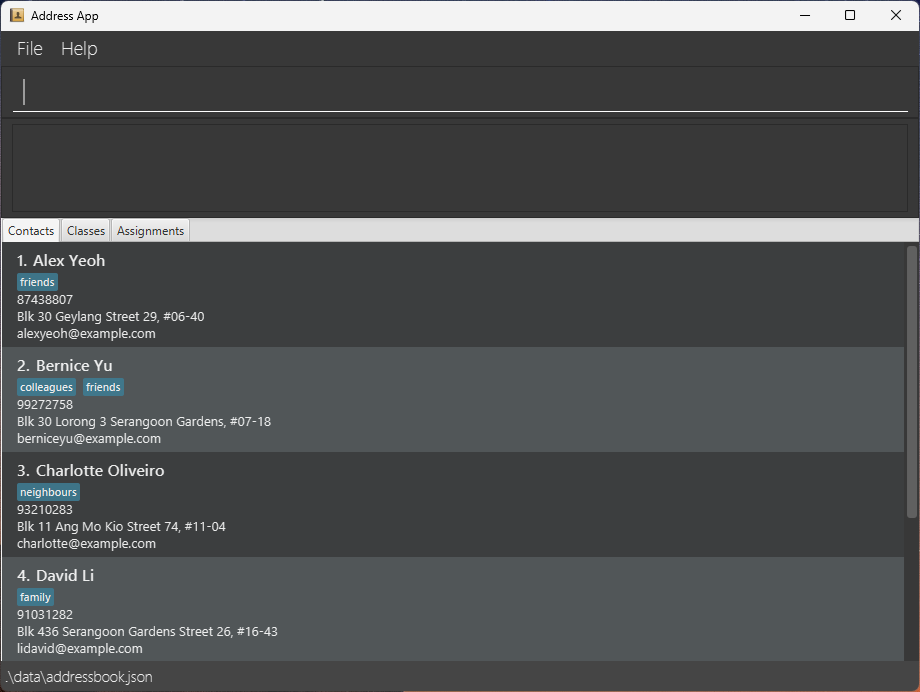
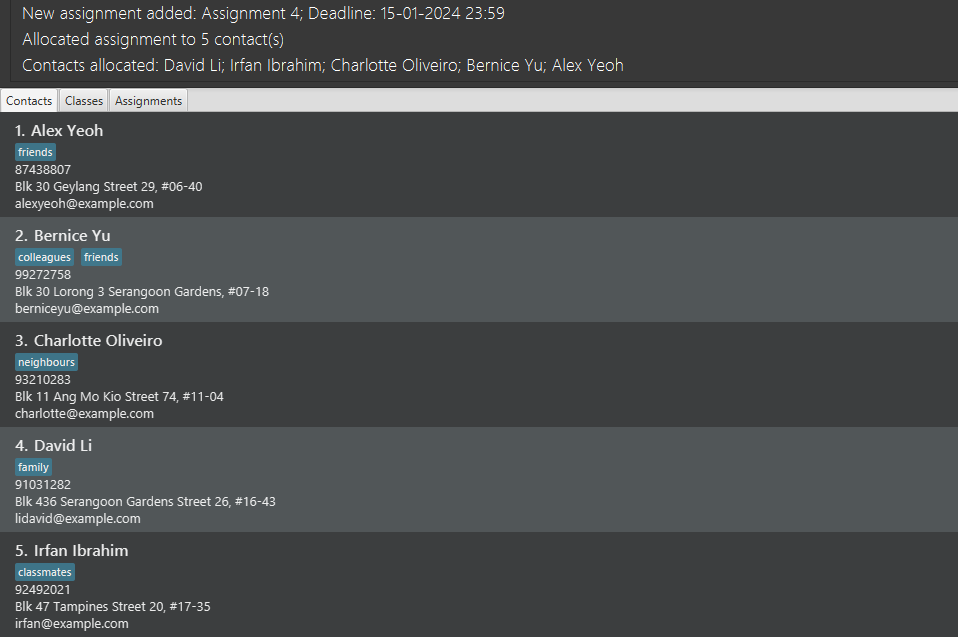

<div class="user-guide">

# Classroom Plus Plus (CPP) User Guide

Classroom Plus Plus (CPP) is a desktop application designed for educators to manage student and staff contact information, classes, and assignment tracking from a single, centralized place. CPP combines a simple Graphical User Interface (GUI) with a powerful Command-Line Interface (CLI) so teachers can work quickly and reliably.

**Who this guide is for**

* **Primary users:** Primary and secondary school teachers and tutors who manage classes and student records.

* **Assumed skills:** Basic computer literacy, and comfortable using a CLI. No prior experience with Java or software development is required.

**How to use this guide**

* Use the [**Quick start**](#quick-start) section to install and run the app fast.

* Use [**Features**](#features) to view the full list of features, command reference, and examples.

* Use [**FAQ**](#faq) and [**Known issues**](#known-issues-and-workarounds) when troubleshooting.

* Refer to the [**Command summary**](#command-summary) for a quick reference of all commands and formats.

* Use the page navigation at the side to jump between sections.

--------------------------------------------------------------------------------------------------------------------

## Table of contents

* [Quick start](#quick-start)
* [Features](#features)
* [FAQ](#faq)
* [Known issues and workarounds](#known-issues-and-workarounds)
* [Command summary](#command-summary)

--------------------------------------------------------------------------------------------------------------------

## Quick start

This quick start assumes you are a teacher who wants to install CPP, open the application, and run a few common commands to manage your contacts, classes, and assignments. Follow the short steps below, then consult [**Features**](#features) for full command details.

### Prerequisites

* Minimum disk space: `500 MB` for app + data. Please refer to the section on [**How to check available disk space**](#how-to-check-available-disk-space) to ensure you have enough free space.

* Java 17 or newer must be installed and available on your PATH. Please refer to the section on [**How to check and install Java**](#how-to-check-and-install-java) to check your Java version and install Java if needed.

#### How to check available disk space

<box type="info">As a reference, 1 TB = 1048576 MB, 1 GB = 1024 MB.</box>

**Windows:**

1. Open File Explorer and navigate to **"This PC"** or **"My Computer"**.

1. Look for the drive where you plan to store the app home (e.g., `C:\` or `D:\`).

1. Check the **"Free space"** column for that drive to ensure it has at least `500MB` free.

1. If you have enough free space, you may proceed to check the Java version as described in the next section [**How to check and install Java**](#how-to-check-and-install-java).

**macOS:**

1. Click on the Apple menu and select "About This Mac".

1. Go to the "Storage" tab.

1. Check the available space for the drive where you plan to store the app home (e.g., Macintosh HD) to ensure it has at least `500MB` free.

1. If you have enough free space, you may proceed to check the Java version as described in the next section [**How to check and install Java**](#how-to-check-and-install-java).

#### How to check and install Java

**Windows:**

1. Open Command Prompt or PowerShell by searching for it in the Windows Search Bar.

1. To check Java from Command Prompt or PowerShell, run `java -version`.

1. If Java is installed, you should see output showing the Java version (e.g., `java version "17.0.1"`).
    <box type="info">Any version that is 17.0.0 or newer is acceptable.</box>
    <box type="warning">Older versions (e.g., Java 8) will not work and must be updated using Step 4.</box>
    <box type="warning">If you see an error like 'java' is not recognized, it means Java is not installed. Please follow Step 4 to install Java.</box>

    

1. If Java is not found, you may refer to the [Windows guide](https://se-education.org/guides/tutorials/javaInstallationWindows.html) to install Java 17.

1. Once Java is installed, repeat Steps 1-3 to verify the installation.

**macOS:**

1. Open Terminal by searching for it in the Applications folder or using Mac's Spotlight.

1. To check Java from Terminal, run `java -version`.

1. If Java is installed, you should see output showing the Java version (e.g., `java version "17.0.1"`).
    <box type="info">Any version that is 17.0.0 or newer is acceptable.</box>
    <box type="warning">Older versions (e.g., Java 8) will not work and must be updated using Step 4.</box>
    <box type="warning">If you see an error like "bash: java: command not found", it means Java is not installed. Please follow Step 4 to install Java.</box>

    
    <p style="font-size: 0.9em; color: #666; text-align: center; margin-top: 0;">(Source: tutorials24x7)</p>

1. If Java is not found, you may refer to the [macOS guide](https://se-education.org/guides/tutorials/javaInstallationMac.html) to install Java 17.

1. Once Java is installed, repeat Steps 1-3 to verify the installation.

### Install and run

1. Download the latest `cpp.jar` from the project [release page](https://github.com/AY2526S2-CS2103T-T10-1/tp/releases).

1. Move it to a folder that you will use as the app home.
    <box type="info">A subfolder "data/" and a file "preferences.json" will both be created in this folder.</box>

1. Users are **strongly encouraged to create a dedicated folder for CPP** (e.g., `Documents/CPP`) rather than running the `cpp.jar` file from a temporary download folder to prevent the accidental deletion of data files.

1. Open the folder where you saved `cpp.jar`, right click on an empty space in the folder and select **"Open in Terminal" (macOS)** or **"Open Command Prompt here" (Windows)**.
   <box type="info">On later versions of Windows, you may also see "Open in Terminal" which is also fine.</box>

1. To launch the app, type in the following command and press Enter:

    ```bash
    java -jar cpp.jar
    ```

\
Within a few seconds the application will appear. The main User Interface (UI) contains from top to bottom:

* A command box to enter CLI commands.

* A result display that shows the output of commands and brief success/error messages.

* A central list panel with a toggle to show contacts, classes, or assignments.

    <box type="info">The app will automatically load some default contacts on first launch.</box>



### Quick CLI tutorial (common tasks and expected output)

#### Tips

<box type="tip" seamless>

* Do not attempt to copy multiple commands at once. Copy and paste one command at a time, and wait for the result display to show the confirmation message before pasting the next command.

* Use `help` in the command box for a quick list of commands: `help`.

* If you are unsure of the command format, you may enter the command with incomplete parameters (e.g., `addcontact n/John Doe`) and the app will show an error message with the correct usage.

</box>

* **List all contacts:**

    Command:

    ```text
    list contacts
    ```

    Expected: Displays a numbered list of contacts in the main panel.

    ```text
    Listed all contacts
    ```

* **Add a contact John Doe with phone, email, address and tags:**

    Command:

    ```text
    addcontact n/John Doe p/98765432 e/johnd@example.com a/311, Clementi Ave 2 t/TransferStudent t/FinancialAid
    ```

    Expected: Confirmation message in result display and new contact appears in the list.

    ```text
    New contact added: John Doe; Phone: 98765432; Email: johnd@example.com; Address: 311, Clementi Ave 2; Tags: [TransferStudent][FinancialAid]
    ```

* **Delete the 1st, 2nd and 3rd contact in the list:**

    Command:

    ```text
    delete ct/1 2 3
    ```

    Expected: Confirmation message in result display and contact list updated with the deleted contact removed.

    ```text
    Deleted Contact: Alice Yeoh; Phone: 87438807; Email: alexyeoh@example.com; Address: Blk 30 Geylang Street 29, #06-40; Tags: [friends]
    Deleted Contact: Bernice Yu; Phone: 99272758; Email: berniceyu@example.com; Address: Blk 30 Lorong 3 Serangoon Gardens, #07-18; Tags: [colleagues][friends]
    Deleted Contact: Charlotte Oliveiro; Phone: 93210283; Email: charlotte@example.com; Address: Blk 11 Ang Mo Kio Street 74, #11-04; Tags: [neighbours]
    ```

* **Find by name keywords (case-insensitive):**

    Command:

    ```text
    findcontact dAviD IRFAN
    ```

    Expected: Confirmation message in result display and contact list updated to show only David Li and Irfan Ibrahim.

    ```text
    2 contacts listed!
    ```

#### Warnings and expected failures

<box type="warning" seamless>

* Back up your data folder (`data/addressbook.json`) before manual edits. A corrupted `addressbook.json` will cause the app to start with an empty dataset.

* The app prevents obvious duplicates at entry; if you attempt to add contacts, assignments, or classes with the same name, CPP will reject the entry with an explanatory error.

</box>

Refer to the [**Features**](#features) below for advanced features with the full command format, options and advanced examples.

--------------------------------------------------------------------------------------------------------------------

## Features

<box type="info" seamless>

**Notes about the command format:**<br>

* Words in `UPPER_CASE` are the parameters to be supplied by the user.<br>
  e.g. in `addcontact n/NAME`, `NAME` is a parameter which can be used as `addcontact n/John Doe`.

* Items in square brackets are optional.<br>
  e.g `n/NAME [t/TAG]...` can be used as `n/John Doe t/friend` or as `n/John Doe`.

* Items with `...` after them can be used multiple times.<br>
  e.g. `[t/TAG]...` can be used as ` ` (i.e. 0 times), `t/friend`, `t/friend t/family` etc.<br>
  e.g. `ct/CONTACT_INDICES...` can be used as `ct/1`, `ct/1 2 3`, `ct/1 3 5 7` etc.

* Parameters can be in any order.<br>
  e.g. if the command specifies `n/NAME p/PHONE_NUMBER`, `p/PHONE_NUMBER n/NAME` is also acceptable.

* Extraneous parameters for commands that do not take in parameters (such as `help`, `exit`, and `clear`) will be ignored.<br>
  e.g. if the command specifies `help 123`, it will be interpreted as `help`.

* If you are using a PDF version of this document, be careful when copying and pasting commands that span multiple lines as space characters surrounding line-breaks may be omitted when copied over to the application.
</box>

### Viewing help : `help`

Shows a message explaining how to access the help page.


Format: `help`

### Adding a contact: `addcontact`

Adds a contact to the address book.

Format: `addcontact n/NAME p/PHONE_NUMBER e/EMAIL a/ADDRESS [c/CLASS_NAME] [ass/ASSIGNMENT_NAME] [t/TAG]...`

* Creates a contact with the specified `NAME`, `PHONE_NUMBER`, `EMAIL` and `ADDRESS`.

* The `NAME` provided must only contain alphanumeric characters and spaces only. It cannot be blank.

* The `NAME` must be unique across all contacts (case-insensitive).

* The `PHONE_NUMBER` provided must only contain numeric digits (0-9), be a minimum of 3 digits long, and cannot be blank.

* The `EMAIL` provided must be in the format `local-part@domain`.

  * The local part can contain alphanumeric characters and special characters (`+`, `.`, `-`), but cannot start or end with special characters.

  * The domain must contain at least one period, each label must be alphanumeric with optional hyphens between characters, and the top-level domain must be at least 2 characters long. No spaces allowed, and cannot be blank.

* The `ADDRESS` provided can contain any characters, and cannot be blank.

* `c/CLASS_NAME` is optional and can be used to allocate the specified class to the contact. If the `c/` prefix is included, the `CLASS_NAME` must match the name of an existing class (case-insensitive).

* `ass/ASSIGNMENT_NAME` is optional and can be used to allocate the specified assignment to the contact. If the `ass/` prefix is included, the `ASSIGNMENT_NAME` must match the name of an existing assignment (case-insensitive).

* `t/TAG` is optional and can be used to add tags to the contact. Each `TAG` must be a single alphanumeric word (no spaces), and tags are case-sensitive.

* If multiple instances of the same tag are provided, the command still succeeds, but only one instance of that tag is added.

<box type="warning" seamless>

* If the specified class or assignment does not exist, the command will fail and no contact is created.

* If any of the parameters are invalid, the command will also fail and no contact is created.

</box>

<box type="tip" seamless>

**Tip:** A contact can have any number of tags (including 0)
</box>

Examples:

* `addcontact n/Betsy Crowe e/betsycrowe@example.com a/Betsy Street, Block 123, #06-07 p/1234567` <br>
  Creates a contact with the name "Betsy Crowe", phone number "1234567", email "betsycrowe<span></span>@example.com", address "Betsy Street, Block 123, #06-07"

* `addcontact n/John Doe p/98765432 e/johnd@example.com a/311, Clementi Ave 2, #02-25 c/CS2103T10 ass/Assignment 1 t/friends t/owesMoney`<br>
  Creates a contact with the name "John Doe", phone number "98765432", email "johnd<span></span>@example.com", address "311, Clementi Ave 2, #02-25", allocated to class group "CS2103T10" and assignment "Assignment 1", with tags "friends" and "owesMoney".

### Listing all contacts : `list`

Shows a list of all contacts in the address book.

Format: `list`

### Editing a contact : `edit`

Edits an existing contact in the address book.

Format: `edit INDEX [n/NAME] [p/PHONE] [e/EMAIL] [a/ADDRESS] [t/TAG]...`

* Edits the contact at the specified `INDEX`. The index refers to the index number shown in the displayed contact list. The index **must be a positive integer** 1, 2, 3, ...

* At least one of the optional fields must be provided.

* Existing values will be updated to the input values.

* When editing tags, the existing tags of the contact will be removed i.e adding of tags is not cumulative.

* You can remove all the contact’s tags by typing `t/` without specifying any tags after it.

Examples:

* `edit 1 p/91234567 e/johndoe@example.com` Edits the phone number and email address of the 1st contact to be `91234567` and `johndoe@example.com` respectively.

* `edit 2 n/Betsy Crower t/` Edits the name of the 2nd contact to be `Betsy Crower` and clears all existing tags.

### Locating contacts by name: `find`

Finds contacts whose names contain any of the given keywords.

Format: `find KEYWORD [MORE_KEYWORDS]`

* The search is case-insensitive. e.g `hans` will match `Hans`

* The order of the keywords does not matter. e.g. `Hans Bo` will match `Bo Hans`

* Only the name is searched.

* Only full words will be matched e.g. `Han` will not match `Hans`

* Contacts matching at least one keyword will be returned (i.e. `OR` search).<br>
  e.g. `Hans Bo` will return `Hans Gruber`, `Bo Yang`

Examples:

* `find John` returns `john` and `John Doe`

* `find alex david` returns `Alex Yeoh`, `David Li`<br>
  

### Deleting a contact : `delete`

Deletes the specified contact from the address book.

Format: `delete INDEX`

* Deletes the contact at the specified `INDEX`.

* The index refers to the index number shown in the displayed contact list.

* The index **must be a positive integer** 1, 2, 3, ...

Examples:

* `list` followed by `delete 2` deletes the 2nd contact in the address book.

* `find Betsy` followed by `delete 1` deletes the 1st contact in the results of the `find` command.

### Adding classes: `addclass`

Adds a class to the address book.

Format: `addclass c/CLASS_NAME [ct/CONTACT_INDICES...]`

* Creates a class with the specified `CLASS_NAME`. The `CLASS_NAME` must be unique and should not match the name of any existing class (case-insensitive).

* `ct/CONTACT_INDICES...` is optional and can be used to allocate the class to specific contacts upon creation. If the `ct/` prefix is included, at least 1 contact index must be specified.

* These `CONTACT_INDICES...` must contain 1 or more positive integers 1, 2, 3, ..., referring to the index number shown in the displayed contact list.

<box type="warning" seamless>

* If any of the specified contacts do not exist, the command will fail and no class is created.

* If any of the parameters are invalid, the command will also fail and no class is created.

* The contact indices specified refer to the currently displayed contact list after filtering (e.g., after a `find` command). It is recommended to run `list contacts` before this command to ensure the correct contact indices are used.

</box>

Examples:

* `addclass c/CS2103T-T10-1`<br>
  Creates a class with the name "CS2103T-T10-1".

* `list contacts` followed by `addclass c/CS2103T-T10-1 ct/1 2 3`<br>
  Creates a class with the name "CS2103T-T10-1" allocated to the 1st, 2nd, and 3rd contacts.

### Allocating classes to contacts: `allocclass`

Allocates a class to specific contacts.

Format: `allocclass c/CLASS_NAME ct/CONTACT_INDICES...`

* The `CLASS_NAME` must match the name of an existing class (case-insensitive).

* These `CONTACT_INDICES...` must contain 1 or more positive integers 1, 2, 3, ..., referring to the index number shown in the displayed contact list.
  
<box type="warning" seamless>

* If any of the specified contacts or class do not exist, the command will fail and no allocation is done.

* If any of the parameters are invalid, the command will also fail and no allocation is done.

* The contact indices specified refer to the currently displayed contact list after filtering (e.g., after a `find` command). It is recommended to run `list contacts` before this command to ensure the correct contact indices are used.

* Reallocating a class to a contact that already belongs to that class will not cause any changes to the contact's class memberships. However, if no successful allocations are performed at the end of the command, the command will fail and the user will see an error message specifying the issue.

</box>

Examples:

* `list contacts` followed by `allocass c/CS2103T-T10-1 ct/1`<br>
  Allocates the class "CS2103T-T10-1" to only the 1st contact in the list.

* `list contacts` followed by `allocass c/CS2103T-T10-1 ct/1 2 3`<br>
  Allocates the class "CS2103T-T10-1" to the 1st, 2nd, and 3rd contacts in the list.

### Unallocating classes from contacts: `unallocclass`

Unallocates a class from specific contacts.

Format: `unallocclass c/CLASS_NAME ct/CONTACT_INDICES...`

* The `CLASS_NAME` must match the name of an existing class (case-insensitive).

* These `CONTACT_INDICES...` must contain 1 or more positive integers 1, 2, 3, ..., referring to the index number shown in the displayed contact list.
  
<box type="warning" seamless>

* If any of the specified contacts or class do not exist, the command will fail and no allocation is done.

* If any of the parameters are invalid, the command will also fail and no allocation is done.

* The contact indices specified refer to the currently displayed contact list after filtering (e.g., after a `find` command). It is recommended to run `list contacts` before this command to ensure the correct contact indices are used.

* Unallocating a class from a contact that does not belong to that class will not cause any changes to the contact's class memberships. However, if no successful unallocations are performed at the end of the command, the command will fail and the user will see an error message specifying the issue.

</box>

Examples:

* `list contacts` followed by `unallocass c/CS2103T-T10-1 ct/1`<br>
  Unallocates the class "CS2103T-T10-1" from only the 1st contact in the list.

* `list contacts` followed by `unallocass c/CS2103T-T10-1 ct/1 2 3`<br>
  Unallocates the class "CS2103T-T10-1" from the 1st, 2nd, and 3rd contacts in the list.

### Adding assignments: `addass`

Adds an assignment to the address book.

Format: `addass ass/ASSIGNMENT_NAME d/DEADLINE [c/CLASS_NAME] [ct/CONTACT_INDICES...]`

* Creates an assignment with the specified `ASSIGNMENT_NAME` and `DEADLINE`. The `ASSIGNMENT_NAME` must be unique and should not match the name of any existing assignment (case-insensitive).

* The `DEADLINE` provided must be in the format `dd-MM-yyyy HH:mm`.

* `c/CLASS_NAME` is optional and can be used to allocate the assignment to all contacts in that class. If the `c/` prefix is included, the `CLASS_NAME` must match the name of an existing class (case-insensitive).

* `ct/CONTACT_INDICES...` is optional and can be used to allocate the assignment to specific contacts. If the `ct/` prefix is included, at least 1 contact index must be specified.

* These `CONTACT_INDICES...` must be positive integers 1, 2, 3, ..., referring to the index number shown in the displayed contact list.

<box type="warning" seamless>

* If any of the specified contacts or classes do not exist, the command will fail and no assignment is created.

* If any of the other parameters are invalid, the command will also fail and no assignment is created.

* The contact indices specified refer to the currently displayed contact list after filtering (e.g., after a `find` command). It is recommended to run `list contacts` before this command to ensure the correct contact indices are used.

* If the specified class does not contain any students, the command will fail and no assignment is created.

</box>

<box type="tip" seamless>

* You can enter both the `c/CLASS_NAME` and `ct/CONTACT_INDICES...` parameters to allocate the assignment to specific contacts at the time of creation. This is optional and can also be done later using the `allocass` command.

</box>

Examples:

* `addass ass/Assignment 1 d/01-12-2023 23:59`<br>
  Creates an assignment with the name "Assignment 1" and deadline "1 Dec 2023 23:59".

* `addass ass/Assignment 2 d/15-12-2023 23:59 c/CS2103T-T10-1`<br>
  Creates an assignment with the name "Assignment 2" and deadline "15 Dec 2023 23:59", allocated to all contacts belonging to class "CS2103T-T10-1".

* `list contacts` followed by `addass ass/Assignment 3 d/30-12-2023 23:59 ct/1 2 3`<br>
  Creates an assignment with the name "Assignment 3" and deadline "30 Dec 2023 23:59", allocated to the 1st, 2nd, and 3rd contacts in the list.

* `list contacts` followed by `addass ass/Assignment 4 d/15-01-2024 23:59 c/CS2103T-T10-1 ct/4 5`<br>
  Creates an assignment with the name "Assignment 4" and deadline "15 Jan 2024 23:59", allocated to the 4th and 5th contacts in the list, as well as all contacts belonging to class "CS2103T-T10-1".
  
  The screenshot below illustrates the last example, where the class "CS2103T-T10-1" consists of contacts 2-5.\
  

### Allocating assignments to contacts: `allocass`

Allocates an assignment to specific contacts.

Format: `allocass ass/ASSIGNMENT_NAME [c/CLASS_NAME] [ct/CONTACT_INDICES...]`

* Allocates the assignment to the specified contacts, as well as all contacts in the specified class.

* The `ASSIGNMENT_NAME` must match the name of an existing assignment (case-insensitive).

* At least 1 of `[c/CLASS_NAME]` or `[ct/CONTACT_INDICES...]` must be provided.

* The `CLASS_NAME` must match the name of an existing class (case-insensitive).

* The `CONTACT_INDICES...` must contain 1 or more positive integers 1, 2, 3, ..., referring to the index number shown in the displayed contact list.
  
<box type="warning" seamless>

* If any of the specified contacts or classes do not exist, the command will fail and no allocation is done.

* If any of the parameters are invalid, the command will also fail and no allocation is done.

* The contact indices specified refer to the currently displayed contact list after filtering (e.g., after a `find` command). It is recommended to run `list contacts` before this command to ensure the correct contact indices are used.

* If the specified class does not contain any students, the command will fail and no allocation is done.

* If no contacts are allocated at the end of the command, the command will fail and the user will see an error message specifying the issue.

</box>

<box type="tip" seamless>

* You can enter both the `c/CLASS_NAME` and `ct/CONTACT_INDICES...` parameters to allocate the assignment to more contacts at the same time.

</box>

Examples:

* `allocass ass/Assignment 1 ct/1 2 3`<br>
  Allocates the "Assignment 1" to the 1st, 2nd, and 3rd contacts in the list.

* `allocass ass/Assignment 2 c/CS2103T-T10-1`<br>
  Allocates the "Assignment 2" to all contacts in the "CS2103T-T10-1" class.

* `allocass ass/Assignment 3 c/CS2103T-T10-1 ct/1 2 3`<br>
  Allocates the "Assignment 3" to the 1st, 2nd, and 3rd contacts in the list, as well as all contacts belonging to class "CS2103T-T10-1".

  The screenshot below illustrates the last example, where the class "CS2103T-T10-1" contains contacts 2-5, and contact 3 was already allocated the assignment.<br>
  

### Unallocating assignments from contacts: `unallocass`

Unallocates an assignment from specific contacts.

Format: `unallocass ass/ASSIGNMENT_NAME [c/CLASS_NAME] [ct/CONTACT_INDICES...]`

* Unallocates the assignment from the specified contacts, as well as all contacts in the specified class.

* The `ASSIGNMENT_NAME` must match the name of an existing assignment (case-insensitive).

* At least 1 of `[c/CLASS_NAME]` or `[ct/CONTACT_INDICES...]` must be provided.
  
* The `CLASS_NAME` must match the name of an existing class (case-insensitive).

* The `CONTACT_INDICES...` must contain 1 or more positive integers 1, 2, 3, ..., referring to the index number shown in the displayed contact list.
  
<box type="warning" seamless>

* If any of the specified contacts or classes do not exist, the command will fail and no unallocation is done.

* If any of the parameters are invalid, the command will also fail and no unallocation is done.

* The contact indices specified refer to the currently displayed contact list after filtering (e.g., after a `find` command). It is recommended to run `list contacts` before this command to ensure the correct contact indices are used.

* If the specified class does not contain any students, the command will fail and no unallocation is done.

* If no contacts are unallocated at the end of the command, the command will fail and the user will see an error message specifying the issue.

</box>

<box type="tip" seamless>

* You can enter both the `c/CLASS_NAME` and `ct/CONTACT_INDICES...` parameters to unallocate the assignment from more contacts at the same time.

</box>

Examples:

* `unallocass ass/Assignment 1 ct/1 2 3`<br>
  Unallocates the "Assignment 1" from the 1st, 2nd, and 3rd contacts in the list.

* `unallocass ass/Assignment 2 c/CS2103T-T10-1`<br>
  Unallocates the "Assignment 2" from all contacts in the "CS2103T-T10-1" class.

* `unallocass ass/Assignment 3 c/CS2103T-T10-1 ct/1 2 3`<br>
  Unallocates the "Assignment 3" from the 1st, 2nd, and 3rd contacts in the list, as well as all contacts belonging to class "CS2103T-T10-1".

  The screenshot below illustrates the last example, where the class "CS2103T-T10-1" contains contacts 2-5, and only contacts 1, 2, 4, and 5 had the assignment allocated.<br>
  

### Clearing all entries : `clear`

Clears all entries from the address book.

Format: `clear`

### Exiting the program : `exit`

Exits the program.

Format: `exit`

### Saving the data

AddressBook data is saved in the hard disk automatically after any command that changes the data. There is no need to save manually.

### Editing the data file

AddressBook data is saved automatically in `[JAR file location]/data/addressbook.json`. Advanced users are welcome to update data directly by editing that data file.

<box type="warning" seamless>

**Caution:**
If your changes to the data file makes its format invalid, AddressBook will discard all data and start with an empty data file at the next run.  Hence, it is recommended to take a backup of the file before editing it.<br>
Furthermore, certain edits can cause the AddressBook to behave in unexpected ways (e.g., if a value entered is outside the acceptable range). Therefore, edit the data file only if you are confident that you can update it correctly.
</box>

### Archiving data files `[coming in v2.0]`

_Details coming soon ..._

--------------------------------------------------------------------------------------------------------------------

## FAQ

**Q**: How do I transfer my data to another computer?\
**A**: Install CPP on the other computer by following the installation instructions in [**Install and run**](#install-and-run), then copy the `data/addressbook.json` file from your existing app home folder into the new app home folder by overwriting the empty file created on first run. Always stop the app before copying files.

**Q**: How can I back up my data and restore it if something goes wrong?\
**A**: Make a copy of `data/addressbook.json` and store it in a safe location such as a cloud or external drive. To restore, stop CPP, replace the `addressbook.json` in the app home `data/` folder, then start CPP.

**Q**: How does CPP prevent duplicate entries?\
**A**: CPP performs basic duplicate detection at entry. **For contacts, classes and assignments**, the **name** should be unique. No 2 contacts, classes nor assignments should share the same name. If you attempt to add a contact, class or assignment that violates these rules, CPP will reject the entry and show an error message.

**Q**: Can I export/import data for other systems (e.g., Excel)?\
**A**: The primary data format used by CPP is JavaScript Object Notation (JSON). We do not support importing from Excel, but users may manually convert their Excel files to JSON format, adhering to the structure and format of the `addressbook.json` file generated on first run. Manual editing of `addressbook.json` is not recommended unless you are comfortable with JSON.

--------------------------------------------------------------------------------------------------------------------

## Known issues and workarounds

1. **Multiple screens / off-screen window**: If you move the app to a secondary monitor and later use only the primary monitor, the GUI may open off-screen.<br>
   Workaround: delete `preferences.json` in the app home folder while the app is closed; the window position will reset on next start.

1. **Minimized Help Window**: If the Help Window is minimized and you run `help` again, the existing window may remain minimized.<br>
   Workaround: restore it manually from the taskbar.

1. **Preferences or data corruption**: If `preferences.json` or `addressbook.json` becomes invalid (e.g., partial writes), CPP will start with an empty dataset.<br>
   Workaround: Always keep backups before making changes.

1. **File permission issues (Windows)**: Running the app from a protected folder (e.g., `C:\Program Files`) may prevent writing `data/` or `preferences.json`.<br>
   Workaround: Run from a user-writable folder (e.g., Documents) or run the terminal as Administrator.

If you encounter other issues, please raise a ticket with the project maintainers and include `data/addressbook.json` and `preferences.json` for troubleshooting.

--------------------------------------------------------------------------------------------------------------------

## Command summary

| Action                    | Format, Examples                                                                                                                                                                                                                                           |
| ------------------------- | ---------------------------------------------------------------------------------------------------------------------------------------------------------------------------------------------------------------------------------------------------------- |
| **Add Contact**           | `addcontact n/NAME p/PHONE_NUMBER e/EMAIL a/ADDRESS [c/CLASS_NAME] [ass/ASSIGNMENT_NAME] [t/TAG]...` <br> e.g., `addcontact n/James Ho p/22224444 e/jamesho@example.com a/123, Clementi Rd, 1234665 c/CS2103T-T10-1 ass/Assignment 1 t/friend t/colleague` |
| **Clear**                 | `clear`                                                                                                                                                                                                                                                    |
| **Add Class**             | `addclass c/CLASS_NAME [ct/CONTACT_INDICES...]` <br> e.g., `addclass c/CS2103T-T10-1 ct/1 2 3`                                                                                                                                                             |
| **Allocate Class**        | `allocclass c/CLASS_NAME ct/CONTACT_INDICES...` <br> e.g., `allocclass c/CS2103T-T10-1 ct/1 2 3`                                                                                                                                                           |
| **Unallocate Class**      | `unallocclass c/CLASS_NAME ct/CONTACT_INDICES...` <br> e.g., `unallocclass c/CS2103T-T10-1 ct/1 2 3`                                                                                                                                                       |
| **Add Assignment**        | `addass ass/ASSIGNMENT_NAME d/DEADLINE [c/CLASS_NAME] [ct/CONTACT_INDICES...]` <br> e.g., `addass ass/Assignment 4 d/15-01-2024 23:59 c/CS2103T-T10-1 ct/4 5`                                                                                              |
| **Allocate Assignment**   | `allocass ass/ASSIGNMENT_NAME [c/CLASS_NAME] [ct/CONTACT_INDICES...]` <br> e.g., `allocass ass/Assignment 3 c/CS2103T-T10-1 ct/1 2 3`                                                                                                                      |
| **Unallocate Assignment** | `unallocass ass/ASSIGNMENT_NAME [c/CLASS_NAME] [ct/CONTACT_INDICES...]` <br> e.g., `unallocass ass/Assignment 3 c/CS2103T-T10-1 ct/1 2 3`                                                                                                                  |
| **Delete**                | `delete INDEX`<br> e.g., `delete 3`                                                                                                                                                                                                                        |
| **Edit**                  | `edit INDEX [n/NAME] [p/PHONE_NUMBER] [e/EMAIL] [a/ADDRESS] [t/TAG]...`<br> e.g.,`edit 2 n/James Lee e/jameslee@example.com`                                                                                                                               |
| **Find**                  | `find KEYWORD [MORE_KEYWORDS]`<br> e.g., `find James Jake`                                                                                                                                                                                                 |
| **List**                  | `list`                                                                                                                                                                                                                                                     |
| **Help**                  | `help`                                                                                                                                                                                                                                                     |

</div>
